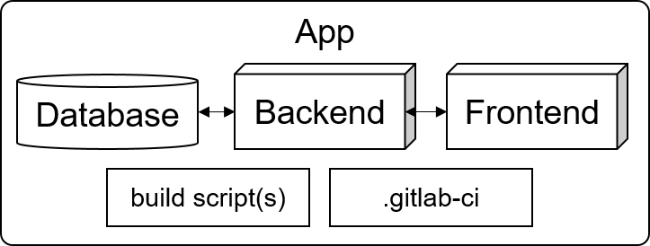

## Tutorial

A guided tutorial through this projects can be found [here](https://monticore.pages.rwth-aachen.de/umlp/Tutorial.html)

The solution is part of this repo and marked with comments of the form `SOL start` and `SOL end`.
A zip where the solution is automatically removed is build by the pipeline and can be found [here](
https://git.rwth-aachen.de/monticore/umlp-anwendungen/montigem3-tutorial/-/jobs/artifacts/dev/raw/build/montigem3-training.zip?job=pack_training) 

This repository contains an exemplary MontiGem 3 project that guides through 
different functionalities of the tool providing a tutorial for getting started.

The tutorial uses an example project to explain available features. Keep in mind
that
- The tooling is experimental, i.e. quite a few features may not work perfectly.
- If you use a SNAPSHOT version of the tooling, it may get updated and even
  break your app.

## Running example

This tutorial develops a car rental system as
an example to explain MontiGem app setup.

## App architecture overview

Here the general MontiGem app architecture is described without going into
details. The details are explained in later parts of the tutorials.

The app has a default configuration that can be changed for a use in production.

- Database implementation can be chosen between
  - in memory DB
  - PostgreSQL
  - Neo4J

  The configuration for the database can be found in the
  `backend/src/main/resources` folder and `backend/build/resources/main` folder
  after building the project.

- Backend uses Spring Boot.
- Frontend uses Angular.
- Gradle is used as build system.
- GitLab CI/CD is used for continous integration.

The database, backend, and frontend implementation is generated from the models
in the `models` folder.
